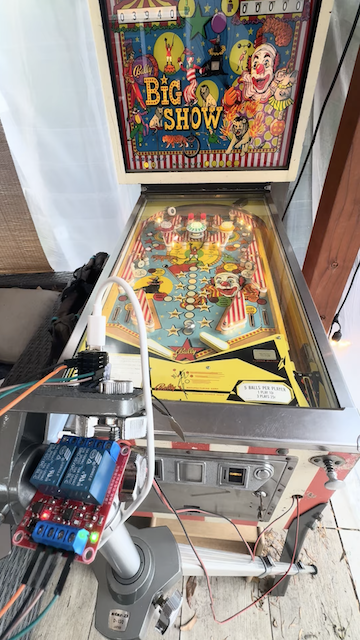
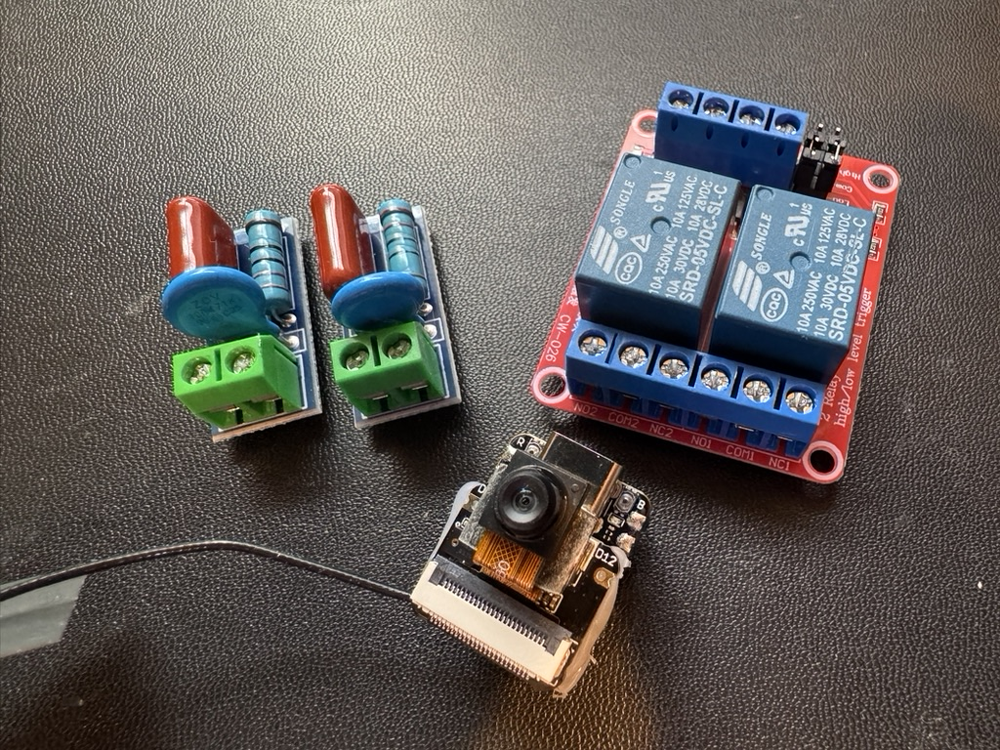

# esp32-pinball-vision-bot

Vision-based autonomous flipper control for electromechanical pinball using an ESP32 camera.

This project demonstrates how a small ESP32-S3 camera board can observe a real electromechanical pinball machine and automatically trigger flippers based on ball motion.

The system runs real-time motion detection on camera frames and activates relays wired in parallel with the cabinet flipper buttons.

The goal is educational and experimental:

- explore embedded vision
- demonstrate edge AI on microcontrollers
- interact with vintage electromechanical hardware
- build a low-cost robotics project (~$30 hardware)

The design intentionally does not modify the original pinball circuitry.

The robot simply acts like a parallel button press.

## Demo
Click to watch video!

---

## What This Is

This project is a small vision-based robot that plays a physical pinball machine.

### Hardware components

- ESP32-S3 camera board
- OV3660 camera sensor
- 2-channel relay module
- RC / MOV snubbers
- wiring to the cabinet flipper button lugs

### Software components

- camera frame capture
- ROI-based motion detection
- flipper trigger logic
- Wi-Fi web UI
- OTA firmware update

The ESP32 performs all processing locally.

No cloud services are required.

---

## Architecture Overview

The system separates responsibilities across the two ESP32 cores.

### Core 1

- camera owner
- frame acquisition
- motion detection
- ball trajectory heuristics

### Core 0

- Wi-Fi networking
- HTTP web interface
- OTA firmware updates
- relay scheduling and safety logic

---

## System Architecture Diagram
~~~text
                         Phone / Laptop
                    (Web UI / Stats / Config)
                               |
                               | Wi-Fi SoftAP + HTTP + OTA
                               v
+--------------------------------------------------------------------------+
|                        XIAO ESP32-S3 Sense                               |
|                                                                          |
|  +---------------------------+      +----------------------------------+ |
|  |           Core 0          |      |            Core 1                | |
|  |   Comms / Control / I/O   |      |        Vision Processing         | |
|  |                           |      |                                  | |
|  |  • Wi-Fi SoftAP           |      |  • Camera owner                  | |
|  |  • HTTP / REST endpoints  |      |  • esp_camera_fb_get/return      | |
|  |  • Web UI / config        |      |  • Frame copy to shared buffer   | |
|  |  • OTA update handler     |      |  • ROI motion detection          | |
|  |  • Auto / manual mode     |      |  • Ball direction heuristics     | |
|  |  • Relay scheduler        |<-----|  • Trigger request L / R         | |
|  |  • Cooldown / safety      | evt  |                                  | |
|  |                           |      |                                  | |
|  |  GPIO2 → LEFT relay       |      |                                  | |
|  |  GPIO3 → RIGHT relay      |      |                                  | |
|  +-------------+-------------+      +-------------+--------------------+ |
|                |                                  ^                      |
|                |                                  | camera frames        |
|                |                         +--------+---------+            |
|                +------------------------>|  OV3660 Camera   |            |
|                                          |  sensor + lens   |            |
|                                          +------------------+            |
+--------------------------------------------------------------------------+
                               |
                               | 3.3 V GPIO control
                               v
                    +--------------------------------------+
                    |        2-Channel Relay Module        |
                    |                                      |
                    |  Logic side                          |
                    |    IN1 ← GPIO2  (LEFT)               |
                    |    IN2 ← GPIO3  (RIGHT)              |
                    |                                      |
                    |  Contact side                        |
                    |    CH1: COM1 / NO1 → LEFT button     |
                    |    CH2: COM2 / NO2 → RIGHT button    |
                    +------------------+-------------------+
                                       |
                 -------------------------------------------------
                 |                                               |
                 v                                               v
            Left Flipper                                   Right Flipper
~~~

---

## System Flow Diagram

~~~mermaid
flowchart TD
A[OV3660 Camera] --> B[Core1 Frame Acquisition]
B --> C[ROI Motion Detection]
C --> D[Ball Motion Heuristics]
D --> E{Trigger Needed}
E -->|Yes| F[Core0 Relay Scheduler]
E -->|No| G[Continue Monitoring]
F --> H[GPIO2 Left Relay]
F --> I[GPIO3 Right Relay]
H --> J[Parallel Left Button Press]
I --> K[Parallel Right Button Press]
L[Phone or Laptop Web UI] --> M[WiFi HTTP Server]
M --> N[Statistics Config OTA]
N --> F
~~~

---

## Electrical Connection Diagram

~~~text
ESP32 GPIO2  ------> Relay IN1 LEFT
ESP32 GPIO3  ------> Relay IN2 RIGHT

CH1 LEFT
COM1 ----- cabinet button lug A
NO1  ----- cabinet button lug B

CH2 RIGHT
COM2 ----- cabinet button lug A
NO2  ----- cabinet button lug B

Snubbers:
RC or MOV placed across COM-NO of each relay channel

Original pinball machine circuit:
~50-57 VAC transformer -> button / EOS -> flipper coil
~~~

## Flipper Wiring Diagram
~~~text
========================= LEFT FLIPPER =========================

Cabinet button (original switch)

     Lug A o------------------------------o Lug B
            \        button path        /
             \_________________________/

Relay wired in PARALLEL with button

     COM1 o------------------------------o NO1
             (wired to Lug A / Lug B)

Snubber across relay contacts

     COM1 o----[ RC snubber or MOV ]----o NO1

Machine circuit (unchanged)

     ~50-57 VAC transformer
            │
            └── button / EOS ──> flipper coil ──> return

========================= RIGHT FLIPPER ========================

Cabinet button (original switch)

     Lug A o------------------------------o Lug B
              \        button path        /
               \_________________________/

Relay wired in PARALLEL with button

     COM2 o------------------------------o NO2
             (wired to Lug A / Lug B)

Snubber across relay contacts

     COM2 o----[ RC snubber or MOV ]----o NO2

Machine circuit (unchanged)

     ~50-57 VAC transformer
            │
            └── button / EOS ──> flipper coil ──> return
~~~

---

## Detailed System Diagram

---

## How To Use

### 1. Hardware

Required components:

- ESP32-S3 camera board
- OV3660 camera
- 2-channel relay module
- RC or MOV snubbers
- jumper wires

The relay contacts must be wired in parallel with the cabinet flipper button lugs.

The robot does not replace the button. It simply acts like an additional switch.

### 2. Flash Firmware

Compile and upload the firmware using Arduino IDE or PlatformIO.

After boot:

1. The ESP32 creates a WiFi access point.
2. Connect your phone or laptop to it.
3. Open the web UI in a browser.

### 3. Configure Regions of Interest

Using the web interface you can:

- set motion detection zones
- adjust thresholds
- enable or disable automatic play
- view statistics and debug data

### 4. Automatic Flipper Control

When the vision pipeline detects ball motion entering a flipper zone:

1. Core 1 requests a trigger.
2. Core 0 schedules the relay pulse.
3. GPIO activates the relay.
4. The relay briefly shorts the flipper button lugs.

This simulates a player pressing the button.

---

## Safety Warning

This project interacts with high-voltage electromechanical hardware.

Vintage pinball machines commonly use about 50 to 60 VAC coil circuits for flippers and solenoids.

Improper wiring or component failure may cause:

- equipment damage
- electric shock
- overheating
- electrical fire
- damage to vintage machines

By using this project you acknowledge that:

- you understand the electrical risks
- you accept full responsibility for any damage or injury
- the authors provide no warranty or guarantee

This project is intended for experienced hobbyists familiar with electronics and electromechanical systems.

Do not attempt this if you are unsure about the electrical safety implications.

Use proper insulation, rated components, and protective measures.

The authors are not responsible for any damage to machines, property, or persons.

---

## License

MIT License

---

## Notes

This project was created as an experimental demonstration of:

- embedded computer vision
- robotics interaction with vintage hardware
- low-cost edge AI systems

It is not intended as a commercial product.
